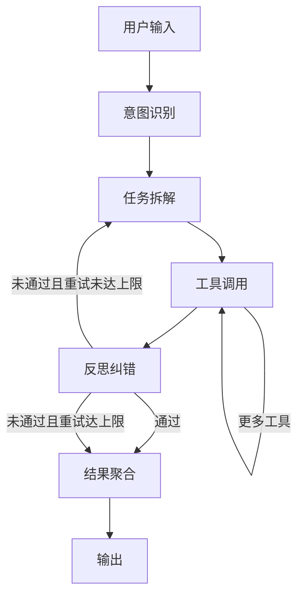

# Agent 规范（P0-1 输出）

## 1. 设计目标

将现有"路由直连业务 service"链路升级为基于 LangGraph 的状态机式 Agent，统一承载教学场景的多任务编排，提供：
- 意图识别（一句话路由到正确业务）
- 任务拆解（复杂请求拆为多步骤）
- 工具调用（统一通过 Function Calling 协议调用业务能力）
- 反思纠错闭环（输出后自检不通过则重做）

底层业务逻辑复用 [backend/app/services/](backend/app/services/) 下现有实现，本文仅定义 Agent 编排层。

## 2. 状态机定义



## 3. 节点定义

### 3.1 意图识别节点（intent_router）
- 输入：用户原始 query + 对话历史滑窗
- 输出：`intent` 标签 + 触发的 `skill_name`（可空）
- 实现：单次 LLM 调用，结构化输出
- 标签集合：见第 4 节

### 3.2 任务拆解节点（planner）
- 输入：用户 query + intent 标签
- 输出：`steps[]`，每个 step 含 `tool_name` 与 `tool_args`
- 简单意图（如纯问答）→ 单步骤；复杂意图（如备课）→ 多步骤
- 若命中 Skill，直接采用 Skill 中预定义步骤序列

### 3.3 工具调用节点（tool_executor）
- 输入：当前 step 的 `tool_name` 与 `tool_args`
- 输出：tool 返回结构 + 错误状态
- 通过 Function Calling 协议调用 MCP Tool 或本地 service 包装
- 单 step 失败重试上限：2 次

### 3.4 反思纠错节点（reflector）
- 输入：累计工具结果 + 最终回答草稿
- 输出：`pass: bool` + `reason`
- 校验维度见第 5 节
- 反思失败时回到 planner 重新拆解（重试上限：1 次）

### 3.5 结果聚合节点（aggregator）
- 将工具结果与 LLM 综述合并为最终响应
- 附带：意图标签、调用工具列表、Trace ID（用于 LangFuse 关联）

## 4. 意图分类

| 标签 | 含义 | 触发示例 | 默认 Skill |
|---|---|---|---|
| `qa` | 知识问答 | "RAG 是什么" | 无（直连 RAG 链路） |
| `exercise_gen` | 出题 | "出 5 道单选" | 无（直连 generate_exercise） |
| `exercise_grade` | 评分 | "判一下我的答案" | `grade-essay`（仅简答题触发） |
| `lesson_plan` | 备课 | "准备 RAG 那一章" | `prepare-class` |
| `recommend` | 个性化推荐 | "推荐我练习" | `personalized-practice` |
| `mixed` | 复合任务 | "总结这章并出 3 道题" | 由 planner 拆解为多 step |
| `unknown` | 兜底 | 未匹配 | 走 `qa` 兜底 |

## 5. 反思纠错维度

| 维度 | 适用意图 | 校验内容 | 失败动作 |
|---|---|---|---|
| `json_schema` | 全部 | 工具输出符合预定 schema | 重试当前 step |
| `kp_match` | exercise_gen / lesson_plan | 输出涉及的知识点是否在指定范围 | 回到 planner 补充约束 |
| `answer_grounded` | qa / lesson_plan | 答案关键陈述是否可在引用片段中找到 | 回到 planner 加大检索 top_k |
| `format_check` | exercise_gen | 题目结构完整（题干/选项/答案/解析） | 重试当前 step |
| `coverage` | lesson_plan | 提纲是否覆盖请求中的所有 knowledge_points | 回到 planner 补步骤 |
| `time_budget` | 全部 | 累计耗时是否超阈值（默认 60s） | 直接进入 aggregator 返回部分结果 |

## 6. 工具集与 Function Calling 协议

工具实际定义见 [memory-bank/mcp-server-spec.md](memory-bank/mcp-server-spec.md)。Agent 通过 MCP 协议调用，schema 一致。

| Tool 名 | 用途 | 调用频率 |
|---|---|---|
| `search_kb` | 知识库混合检索 | 高（几乎所有意图） |
| `lesson_outline` | 章节讲解提纲生成 | lesson_plan |
| `generate_exercise` | 单题/批量出题 | exercise_gen / lesson_plan / recommend |
| `grade_answer` | 单题评测 | exercise_grade |
| `get_mastery` | 知识点掌握度查询 | recommend |
| `web_search` | DashScope 联网搜索 | qa（开关开启时） |

## 7. 与现有 Service 的集成

Agent 不重写业务，仅做薄包装：
- 工具执行层调用 [backend/app/services/](backend/app/services/) 下既有函数
- 业务返回值直接作为 Function Calling 的 `tool_result`
- 失败由 service 层抛异常，Agent 层捕获并按本规范第 8 节处理

## 8. 异常与降级

| 异常 | 处理 |
|---|---|
| 工具调用超时（>15s） | 重试 1 次；仍失败则跳过该 step，反思阶段判断是否可降级 |
| 模型超时（>60s 单次调用） | 直接进入 aggregator，返回当前已有结果 + 失败说明 |
| 反思连续失败 2 次 | 强制进入 aggregator，附 `degraded: true` 标志 |
| MCP Server 不可达 | 降级到本地 service 直连（保留兜底路径） |
| LLM 输出非法 JSON | 调用 LLM 修复 1 次；仍失败则进入失败兜底 |

## 9. 输入输出协议

### 9.1 Agent 入口
```
POST /api/v1/agents/run
{
  "user_input": "帮我准备 RAG 那一章的课，90 分钟",
  "course_id": "course_001",
  "conversation_id": "conv_001",
  "stream": true
}
```

### 9.2 Agent 响应（非流式）
```
{
  "run_id": "run_abc123",
  "intent": "lesson_plan",
  "skill": "prepare-class",
  "steps": [
    {"tool": "search_kb", "args": {...}, "result_summary": "命中 8 条片段"},
    {"tool": "lesson_outline", "args": {...}, "result_summary": "提纲 6 模块"},
    {"tool": "generate_exercise", "args": {...}, "result_summary": "8 题"}
  ],
  "answer": {...},
  "trace_id": "lf_xxx",
  "degraded": false
}
```

### 9.3 流式（SSE）
- `event: intent` —— 意图识别完成
- `event: tool_start` —— 工具开始执行
- `event: tool_end` —— 工具结束
- `event: token` —— LLM 流式 token
- `event: reflect` —— 反思结果
- `event: done` —— 最终聚合结果

## 10. 测试与评估

- Golden Set 中 Agent 任务集（30 条）专项测试 —— 详见 [memory-bank/evaluation-spec.md](memory-bank/evaluation-spec.md)
- 每个意图标签至少 5 条样本
- 端到端指标：成功率（≥90%）、平均工具调用数、反思触发率、重试率
- LangFuse Trace 三层（Agent 节点 / 工具调用 / LLM 调用）必须全部接入

## 11. 与其他规范的关系

- 工具能力定义：[memory-bank/mcp-server-spec.md](memory-bank/mcp-server-spec.md)
- 高层工作流封装：[memory-bank/skills-spec.md](memory-bank/skills-spec.md)
- 评测与可观测：[memory-bank/evaluation-spec.md](memory-bank/evaluation-spec.md)
- 上下文记忆：[memory-bank/memory-spec.md](memory-bank/memory-spec.md)
