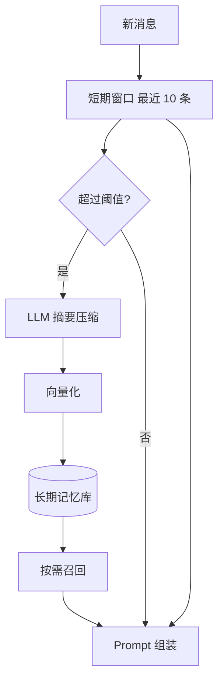

# 分层记忆规范（P0-6 输出）

## 1. 设计目标

将现有"短期滑动窗口"对话记忆升级为**短期 + 长期**分层记忆：
- **短期记忆**：最近 N 条消息直接注入 Prompt（保留原方案）
- **长期记忆**：超出窗口的对话经摘要压缩 + 向量化后入长期记忆库，按需召回

解决问题：
- 多轮长对话中早期信息被滑窗丢弃
- Token 预算不能无限放大
- 跨课程 / 跨日的相关上下文无法回忆

替代并迁移：原 [memory-bank/rag-qa-spec.md](memory-bank/rag-qa-spec.md) §5.4 / §5.5 / §5.6 / §5.7 已迁移至本文。

## 2. 分层模型



## 3. 短期记忆（保留现状）

- 数据：[backend/app/services/memory_store.py](backend/app/services/memory_store.py) + `messages` 表
- 滑窗：每次生成时加载最近 10 条消息（约 5 轮）
- Token 预算：约 2000
- 检索独立：RAG 检索仅基于当前问题，对话历史仅注入 Prompt 生成
- 方案 C 交互（自动进入最近对话 + 可选新建）保留

详见 [memory-bank/rag-qa-spec.md](memory-bank/rag-qa-spec.md) §5.1 - §5.3（仅保留交互模式 + 数据结构 + 管理 API 三节）。

## 4. 长期记忆（新增）

### 4.1 触发策略
满足任一条件触发摘要压缩：
- 对话消息数 ≥ 20（即超出 10 条滑窗 + 一倍冗余）
- 累计 token ≥ 6000
- 用户主动请求"记住这次对话"

每次触发摘要的范围：从上次摘要点起到当前的所有消息。

### 4.2 摘要 Prompt 设计
```
系统：你是对话摘要助手，将给定对话压缩为结构化摘要，保留关键信息便于未来回忆。

要求：
1. 提取讨论主题（≤ 20 字）
2. 列出关键问答对（≤ 5 条）
3. 标记涉及的知识点（如果有）
4. 标记用户偏好或意图（如"偏好详细解析"）
5. 总长度 ≤ 300 字

输出 JSON：
{
  "topic": "...",
  "qa_pairs": [{"q":"...","a":"..."}],
  "knowledge_points": [...],
  "preferences": [...]
}
```

### 4.3 向量化与存储
- 摘要文本 → DashScope text-embedding-v3 → 1024 维向量
- 存储位置：
  - **首选**：MySQL 业务库新表 + 关联 ChromaDB 向量索引（与现有架构一致）
  - **可选**：Redis Vector Set（与短期缓存共用 Redis，运维统一）
- 数据库扩展（与 [memory-bank/microservice-spec.md](memory-bank/microservice-spec.md) §6 协同）：
  ```
  conversation_summaries:
    id              主键
    conversation_id 关联对话
    user_id         所属用户
    course_id       所属课程
    topic           主题摘要
    content         JSON（4.2 输出）
    embedding       1024 维向量
    msg_range       JSON: {"start_msg_id","end_msg_id"}
    created_at
  ```

### 4.4 召回策略
- **触发时机**：每次 RAG 问答前判断是否需要召回长期记忆
- **判断条件**：当前 query 的 embedding 与该用户长期记忆库 Top-3 摘要的最大相似度 ≥ 0.7
- **召回粒度**：返回匹配摘要的 `topic + qa_pairs` 摘要内容（不返回原始消息以控制 token）
- **注入位置**：Prompt 中位于"对话历史"之前，标注"以下是与本问题相关的过往对话摘要"
- **跨对话隔离**：同一用户跨课程的长期记忆默认不互通；当用户在 A 课程提到"还记得我们在 B 课程讨论的 X 吗"时，由 Agent 意图识别决定是否跨课程召回

### 4.5 与 RAG 检索的关系
- **互不替代**：长期记忆是"用户对话历史"，RAG 是"课程知识库"；两者并行召回
- **Prompt 顺序**：system → 长期记忆（如有）→ 对话历史滑窗 → 当前问题 + RAG 上下文
- **token 预算**：长期记忆 ≤ 800 tokens，超出截断最不相关项

## 5. 数据生命周期

| 阶段 | 动作 |
|---|---|
| 创建 | 触发摘要时由 worker 异步生成（详见 [memory-bank/redis-spec.md](memory-bank/redis-spec.md) §5.1 `summarize` 队列） |
| 更新 | 后续摘要新增独立行；不修改历史摘要 |
| 删除 | 用户删除对话时级联删除该对话所有摘要 |
| 归档 | 90 天未访问的摘要可标记为冷数据（可选，不强制） |

## 6. 输入输出协议

### 6.1 触发摘要（内部接口）
```
POST /api/v1/memory/summarize  (内部，不暴露前端)
{ "conversation_id": "conv_001" }
→ 异步任务 task_id
```

### 6.2 召回长期记忆（内部）
```
内部函数 recall_long_term(user_id, query_embedding, course_id?, top_k=3)
→ [{summary_id, topic, content, similarity}]
```

### 6.3 RAG 问答接入
- [backend/app/services/rag_qa.py](backend/app/services/rag_qa.py) 中在拼装 Prompt 前调用 `recall_long_term`
- 注入格式见 §4.4

## 7. 隐私与安全

- 摘要内容不得包含用户敏感信息（PII）：摘要 Prompt 中明确指示去标识化
- 用户可主动清空长期记忆：`DELETE /api/v1/memory/long-term?course_id=...`
- 跨用户严格隔离（`user_id` 必须作为查询条件）

## 8. 测试

| 类别 | 用例 |
|---|---|
| 触发 | 模拟 25 条对话，验证摘要任务被投递且摘要内容合理 |
| 召回 | 给定 query，验证 Top-K 摘要相似度排序正确 |
| 注入 | 验证 Prompt 包含摘要 + 不超过 token 预算 |
| 删除 | 删除对话后，对应摘要应级联删除 |
| 跨用户隔离 | 用户 A 不能召回到用户 B 的摘要（构造样本验证） |

## 9. 与其他规范的关系

- 短期记忆与对话管理 API：[memory-bank/rag-qa-spec.md](memory-bank/rag-qa-spec.md) §5.1-5.3
- 异步摘要任务：[memory-bank/redis-spec.md](memory-bank/redis-spec.md) §5
- 数据库扩展：[memory-bank/microservice-spec.md](memory-bank/microservice-spec.md) §6
- Agent 注入历史摘要的位置：[memory-bank/agent-spec.md](memory-bank/agent-spec.md) §3
