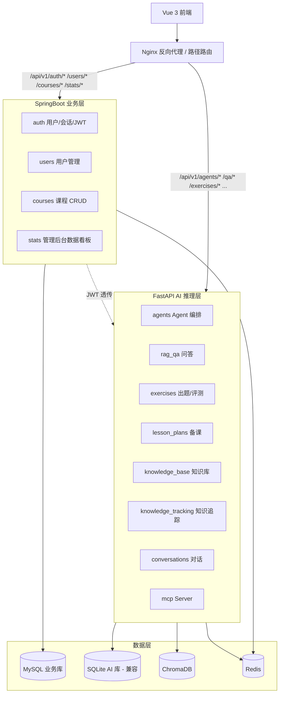

# 双服务微服务架构规范（P0-4 输出）

## 1. 设计目标

将单一 FastAPI 后端拆分为：
- **业务层（SpringBoot）**：Java 生态成熟于企业级业务（事务、权限、审计）
- **AI 推理层（FastAPI）**：Python 生态成熟于 LLM / RAG / Agent 开发

两层通过 HTTP 解耦，独立部署、独立扩缩；前端通过统一网关路由到对应服务。

## 2. 架构总览



## 3. 职责切分

### 3.1 SpringBoot 业务层接管
| 模块 | 现有 FastAPI 文件 | 迁移目标 |
|---|---|---|
| 认证 | [backend/app/auth.py](backend/app/auth.py) + [backend/app/routers/auth.py](backend/app/routers/auth.py) | `AuthController` + Spring Security + JWT |
| 用户 | （无独立路由） | `UserController` + `UserService` |
| 课程 | [backend/app/routers/courses.py](backend/app/routers/courses.py) | `CourseController` + `CourseService` |
| 数据看板 | （未实现） | `AdminStatsController`（聚合查询） |

### 3.2 FastAPI 保留
- `agents` / `rag_qa` / `exercises` / `lesson_plans` / `knowledge_base` / `knowledge_tracking` / `conversations`
- MCP Server（独立进程或同 FastAPI 内启动）

### 3.3 切分原则
- **CRUD + 事务 + 权限**：SpringBoot
- **LLM 调用 + 流式 + 向量检索**：FastAPI
- 业务实体（用户 / 课程）的"读" 由两侧均可访问；"写" 由 SpringBoot 唯一承载

## 4. 技术栈

### 4.1 SpringBoot 业务层
- SpringBoot 3.x
- MyBatis（持久化）
- MySQL 8.x
- Spring Security + JWT（鉴权）
- spring-boot-starter-validation（参数校验）
- Logback（日志）
- 构建：Maven

### 4.2 FastAPI AI 层（沿用现有）
- 见 [memory-bank/tech-stack.md](memory-bank/tech-stack.md)

## 5. 服务间通信

### 5.1 协议
- HTTP / REST（SpringBoot ↔ FastAPI）
- 同步调用为主；异步耗时任务走 [memory-bank/redis-spec.md](memory-bank/redis-spec.md) §4 任务队列

### 5.2 鉴权透传
- Vue 登录 → SpringBoot 颁发 JWT（含 `user_id`、`role`、`exp`）
- 前端调用 FastAPI 时直接携带 JWT
- FastAPI 中间件解析 JWT（共享密钥）→ 注入 `current_user` 到请求上下文
- SpringBoot 调 FastAPI 时透传原 JWT 或使用服务间 service token

### 5.3 服务发现
- 毕设规模：环境变量配置静态 URL（`AI_SERVICE_URL=http://localhost:8001`）
- 不引入 Eureka / Nacos（避免复杂度膨胀）

## 6. 数据库切分

| 数据 | 存储 | 归属服务 |
|---|---|---|
| `users` / `sessions` / `courses` / `knowledge_points` | MySQL | SpringBoot |
| `conversations` / `messages` | MySQL（共享） | 写：FastAPI；读：两侧均可 |
| `knowledge_mastery` / `exercise_attempts` | MySQL（共享） | 写：FastAPI；读：两侧均可 |
| `conversation_summaries` | MySQL + pgvector / 或 Chroma | FastAPI（详见 [memory-bank/memory-spec.md](memory-bank/memory-spec.md)） |
| 知识库向量索引 | ChromaDB | FastAPI |
| 缓存与队列 | Redis | 两侧共用 |
| 评测 Golden Set 与历史 | 文件系统 `data/evaluation/` | FastAPI / CI |

> 现有 SQLite 在迁移期作为开发兼容选项保留；生产环境统一 MySQL。

## 7. 部署与开发命令

### 7.1 开发
```
# 业务服务
cd backend-java && mvn spring-boot:run

# AI 服务
cd backend && uvicorn app.main:app --reload --port 8001

# 前端
cd frontend && npm run dev

# 网关（开发阶段可用 Vite proxy 代替 Nginx）
```

### 7.2 生产（Docker Compose）
- 容器：`spring-business` / `fastapi-ai` / `mysql` / `redis` / `chroma` / `nginx`
- 编排见后续 `docker-compose.yml`（在 implementation-plan 阶段四主线 P0-4 实现）

## 8. 路由与命名约定

- 路径前缀统一 `/api/v1/...`，不变（与 [memory-bank/api-conventions.md](memory-bank/api-conventions.md) 一致）
- 路由由 Nginx 按前缀分发，前端无感知服务边界
- 错误响应格式两侧一致：`{ "error": { "code","message" } }`

## 9. 迁移路径（避免一次性大重构）

| 步骤 | 内容 | 验证 |
|---|---|---|
| 1 | 搭建 SpringBoot 骨架（`backend-java/`），通 MySQL，跑通 healthcheck | curl `/api/v1/health` |
| 2 | 迁移 `auth` + JWT，前端登录改打 SpringBoot | 注册/登录端到端通 |
| 3 | 迁移 `users` + `courses`（含数据迁移脚本：SQLite → MySQL） | 课程 CRUD 通 |
| 4 | 实现 `stats` 数据看板（聚合查询） | 管理端图表跑通 |
| 5 | FastAPI 侧改造：JWT 中间件接收 SpringBoot 颁发的 token | RAG 问答仍通 |
| 6 | 加 Nginx 网关统一入口 | 前端不改代码 |
| 7 | 删除 FastAPI 中已迁走的旧路由 | 接口收敛 |

## 10. 测试

- SpringBoot 侧：JUnit 5 + MockMvc，覆盖鉴权、课程 CRUD、数据看板聚合
- 跨服务集成：脚本模拟登录 → 拿 JWT → 调 FastAPI RAG 问答接口
- 性能：网关层压测 1000 QPS（SpringBoot CRUD），FastAPI 侧不在本规范覆盖范围

## 11. 与其他规范的关系

- API 路径风格：[memory-bank/api-conventions.md](memory-bank/api-conventions.md)
- 缓存与队列：[memory-bank/redis-spec.md](memory-bank/redis-spec.md)
- 评测体系（CI 中需启动两个服务）：[memory-bank/evaluation-spec.md](memory-bank/evaluation-spec.md)
- 用户/课程业务规范：[memory-bank/user-course-spec.md](memory-bank/user-course-spec.md)
