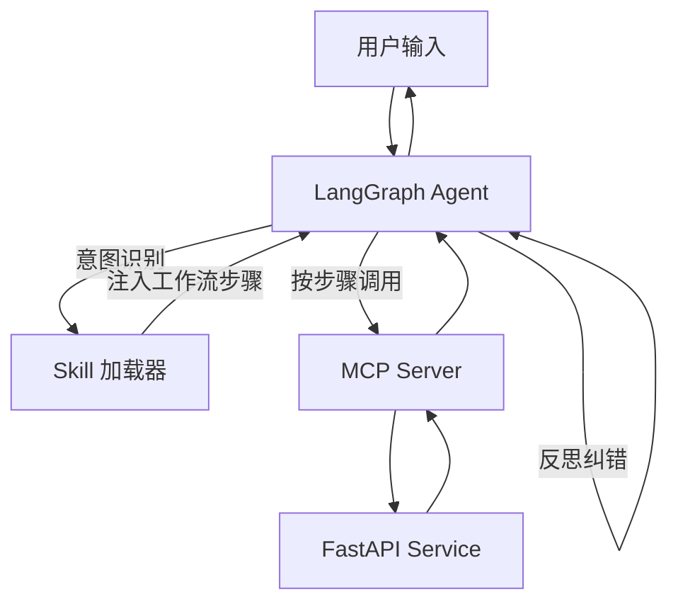

# Agent Skills 规范（P0-2 上层 输出）

## 1. 设计目标

基于 Anthropic Agent Skills 标准格式，封装本系统三类高频教学工作流，使 LLM 在合适场景按预设步骤组合调用 [memory-bank/mcp-server-spec.md](memory-bank/mcp-server-spec.md) 中的原子 Tool，完成复杂任务。

定位：
- **MCP Tool**（原子能力 / 水龙头）
- **Skill**（高层工作流 / 菜谱）
- LangGraph **Agent**（决策大脑，可激活 Skill 作为子流程）

## 2. SKILL.md 标准格式

每个 Skill 是 `backend/skills/{skill_name}/` 目录下的一组文件，核心是 `SKILL.md`：

```
---
name: <skill-name>
description: 何时使用此 skill 的语义化描述（用于 LLM 决定是否激活）
metadata:
  surfaces: [teacher | student | admin]
  tools_required: [<MCP tool name>, ...]
  estimated_tokens: 4000
---

<Markdown 正文：触发条件 / 输入参数 / 工作流步骤 / 反思纠错 / 异常>
```

`description` 是 LLM 路由的关键，必须用具体场景词、动词、对象描述触发条件，避免空泛。

## 3. 三个核心 Skill

### 3.1 `prepare-class`（教师备课）

#### SKILL.md 摘要
- 触发：用户提到"备课 / 准备一节课 / 生成教案 / 出一章练习"
- 输入参数：`course_id`、`chapter`、`duration_minutes`（默认 90）、`knowledge_points`（可选）
- 工作流：
  1. `search_kb`：检索章节资料（top_k=8），空命中则中止并提示
  2. `lesson_outline`：生成教学目标 / 重难点 / 课堂流程 / 实训任务 / 考核建议
  3. `generate_exercise`：3 单选 + 2 判断 + 2 填空 + 1 简答；难度按章节阶段
  4. 聚合输出
- 反思纠错：
  - 教学目标必须覆盖所有指定 knowledge_points，否则回到步骤 2
  - 练习必须含 source_chunks，否则补充
  - 实训任务时长不超过课时 30%
- 异常：知识库为空明确提示，不瞎编

#### 目录
```
backend/skills/prepare-class/
├── SKILL.md
├── reference.md            # 详细模板与高质量样例
└── examples/
    └── rag-class-90min.json
```

### 3.2 `personalized-practice`（个性化练习）

#### SKILL.md 摘要
- 触发：用户说"推荐我练习 / 我哪里弱 / 个性化出题 / 针对薄弱点出题"
- 输入参数：`student_id`（自动从会话上下文）、`course_id`、`weak_threshold`（默认 0.6）、`count`（默认 5）
- 工作流：
  1. `get_mastery`：查询当前学生掌握度
  2. 筛选 mastery < weak_threshold 的知识点（薄弱项）
  3. 若薄弱项为空：触发冷启动诊断练习（中等难度，覆盖核心知识点）
  4. `search_kb`：按薄弱知识点检索资料
  5. `generate_exercise`：定向出题（难度根据掌握度自适应）
  6. 输出推荐练习 + 薄弱知识点解释
- 反思纠错：
  - 题目必须围绕薄弱知识点，否则重出
  - 难度梯度：mastery < 0.3 → easy；0.3-0.6 → medium；其余 → hard
- 异常：mastery 数据为空（新学生）走冷启动路径

#### 目录
```
backend/skills/personalized-practice/
├── SKILL.md
└── reference.md
```

### 3.3 `grade-essay`（简答题多维评分）

#### SKILL.md 摘要
- 触发：用户提交简答题答案，或显式说"帮我评一下简答 / 多维打分"
- 输入参数：`exercise_id`、`student_answer`、`reference_answer`、`rubric`
- 工作流：
  1. `search_kb`：拉取参考答案的源知识库片段（增强评分上下文）
  2. `grade_answer`：调用现有评分逻辑（语义相似度 + LLM 判分加权融合，详见 [memory-bank/exercise-grading-spec.md](memory-bank/exercise-grading-spec.md)）
  3. 多要点拆分评分：按 rubric 关键点逐项匹配，输出每个要点的得失
  4. 输出结构化评分 + 改进建议（matched / missing / suggestion）
- 反思纠错：
  - 总分必须等于各要点加权之和（一致性校验）
  - 缺失要点必须有具体说明（不是泛泛而谈）
- 异常：rubric 缺失时降级到整体匹配评分

#### 目录
```
backend/skills/grade-essay/
├── SKILL.md
└── reference.md
```

## 4. Skill 加载机制

### 4.1 发现
- Agent 启动时扫描 `backend/skills/` 目录
- 解析每个 `SKILL.md` 的 frontmatter（name / description / metadata）
- 构建 Skill 目录索引，注入意图识别节点的 system prompt 中

### 4.2 激活
- 意图识别节点输出 `skill_name: <name> | null`
- 激活时：将该 Skill 的 SKILL.md 正文（不含 reference.md）注入 planner 节点上下文
- planner 严格按 SKILL.md 工作流步骤生成 plan

### 4.3 按需加载 reference.md
- 当 Skill 需要更详细模板（如 `prepare-class` 的"高质量备课样例"）时
- 在 tool 执行前由专门节点读取 reference.md 注入 prompt
- 控制 token 消耗：reference.md 仅在确实需要时加载

## 5. 与 Agent / MCP 的协作



- Skill **不直接执行**，仅提供步骤指引与约束
- 实际执行仍由 Agent 节点 + MCP Tool 完成
- Skill 与 LangGraph 状态机协同：Skill 决定 planner 输出，state 由 Agent 维护

## 6. 命名与扩展约定

- 目录与 `name` 字段保持一致：`<verb-noun>` 形式（kebab-case）
- 单 Skill 步骤数控制在 3-6 步（再多应拆分成多个 Skill）
- 新增 Skill 时必须：
  1. 提供 1-3 条 Golden Set 任务（详见 [memory-bank/evaluation-spec.md](memory-bank/evaluation-spec.md)）
  2. SKILL.md 描述必须能在不读正文的情况下让 LLM 准确判断是否激活
  3. 标注 `tools_required` 中所有 MCP Tool 都已实现

## 7. 测试

| 类别 | 测试点 |
|---|---|
| 单元 | SKILL.md frontmatter 合法性（YAML 解析、必填字段） |
| 路由 | 给定 5 类用户输入，意图识别选中正确 Skill 的命中率 ≥90% |
| 端到端 | 每个 Skill 至少 5 条 Golden Set 任务，平均得分 ≥4.0（5 分制） |
| 反思 | 注入 1 条故意制造缺陷的产出，验证反思能识别并修正 |

## 8. 与其他规范的关系

- 工具层：[memory-bank/mcp-server-spec.md](memory-bank/mcp-server-spec.md)
- Agent 编排：[memory-bank/agent-spec.md](memory-bank/agent-spec.md)
- 评测：[memory-bank/evaluation-spec.md](memory-bank/evaluation-spec.md)
- 评分细则（grade-essay 引用）：[memory-bank/exercise-grading-spec.md](memory-bank/exercise-grading-spec.md)
